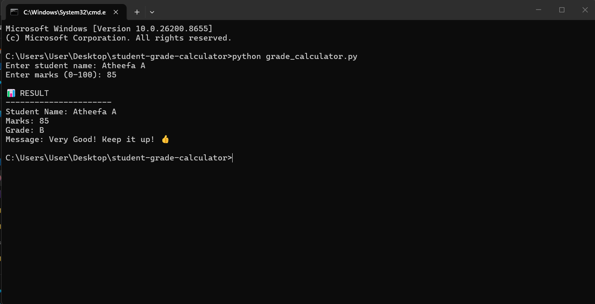
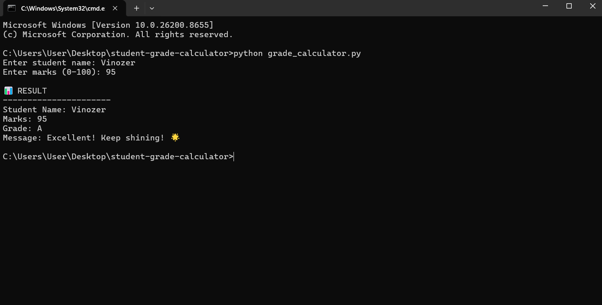

# Student Grade Calculator

## 📖 Project Overview

The Student Grade Calculator is a simple Python program that accepts a student's name and marks, validates the input, calculates the grade using if-elif-else statements, and displays an encouraging message based on the result.

This project is designed to help beginners understand decision-making, loops, functions, and input validation in Python.

## 🎯 Project Objectives

* Learn how to use if-elif-else statements
* Understand comparison operators
* Practice using while loops
* Create and use functions
* Validate user input
* Build a simple interactive Python application

## 🛠️ Setup Instructions

### Prerequisites

* Python 3.x installed on your computer

### Installation

1. Download or clone this repository.
2. Open the project folder.
3. Open Command Prompt or Terminal.
4. Run the following command:

```bash
python grade_calculator.py
```

## 📁 Project Structure

```
student-grade-calculator/
│── README.md
│── grade_calculator.py
│── test_cases.txt
└── screenshots/
    ├── screenshot1.png
    └── screenshot2.png
```

## 📝 Grading Logic

| Marks    | Grade |
| -------- | ----- |
| 90 - 100 | A     |
| 80 - 89  | B     |
| 70 - 79  | C     |
| 60 - 69  | D     |
| 0 - 59   | F     |

## ⚙️ Features

* Accepts student name and marks
* Validates marks between 0 and 100
* Uses if-elif-else for grading
* Uses a while loop for invalid input handling
* Uses a function to calculate grades
* Displays encouraging messages based on performance

## 💻 Technical Requirements Met

* ✅ Uses `input()` to get user information
* ✅ Uses variables to store values
* ✅ Uses `if-elif-else` statements
* ✅ Uses a `while` loop for validation
* ✅ Uses at least one function
* ✅ Displays encouraging messages for every grade
* ✅ Validates marks within the range 0–100

## 🧪 Example Output

```
Enter student name: Priya
Enter marks (0-100): 85

📊 RESULT
----------------------
Student Name: Priya
Marks: 85
Grade: B
Message: Very Good! Keep it up! 👍
```

## 📚 What I Learned

Through this project, I learned:

* How to make decisions using if-elif-else statements
* How to create reusable functions
* How to use while loops for input validation
* How to handle invalid user input
* How to organize a Python project
* How to write and test a simple interactive program

## 📸 Screenshots

### Sample Output 1



### Sample Output 2



## 👨‍💻 Author

Created as part of the Week 2 Python Basics learning project.
